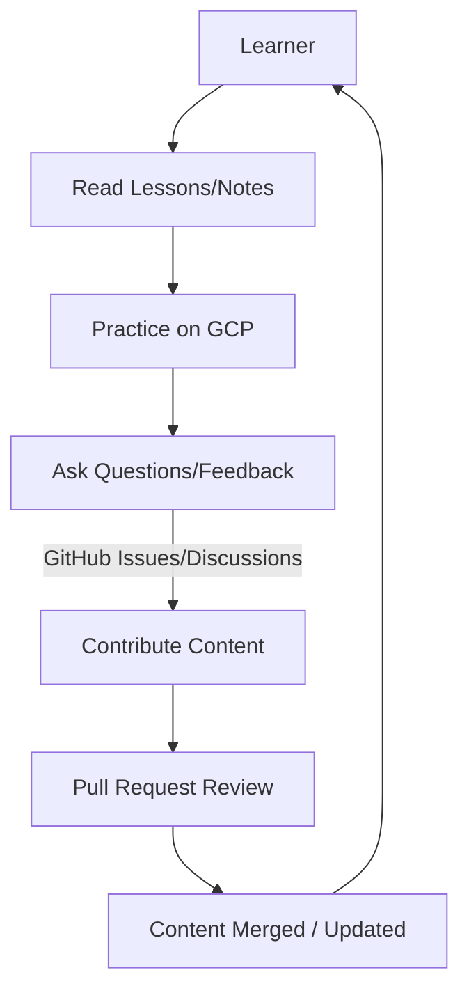

# Welcome I'm Gnanesh Balusa Data Scientist ML Data Associate 2 @Amazon

## 🌩️ GCP with Gnanesh Balusa

**Complete Google Cloud Platform Learning Resource**

  

***

### What is This?

Curated, practical notes and hands-on guides to master Google Cloud Platform, from basics to advanced.\
Perfect for self-learners, certification prep, and real-world GCP use.

***

### Quick Start

1. **Start:** [Day 1 - Cloud Fundamentals](basics/day-1-mastering-how-cloud-works.md)
2. **Practice:** Use GCP Free Tier for examples
3. **Connect:** Join discussions & contribute

***

### Learning Path

| Day | Topic                                                                        | Level    |
| --- | ---------------------------------------------------------------------------- | -------- |
| 1   | [Cloud Fundamentals](basics/day-1-mastering-how-cloud-works.md)              | Beginner |
| 2   | [GCP Hierarchy & Cost](day-2-gcp-hierarchy-and-avoiding-surprising-costs.md) | Beginner |
| 3   | [Compute Engine](day-3-gcp-whats-the-deal-with-compute-engine.md)            | Beginner |

***

### How to Contribute

* Read [Contributing Guidelines](CONTRIBUTING.md)
* Suggest improvements, add content, or report issues

***

### License

Boost Software License 1.0 — Free to use, modify, and distribute.\
See [LICENSE](LICENSE/) for details.

***

### **Architecture Diagram**

***

### Connect

* **LinkedIn:** [Gnanesh Balusa](https://www.linkedin.com/in/gnanesh-balusa/)
* **GitHub:** [gnanesh-16](https://github.com/gnanesh-16)

***

**Begin your GCP journey now! 🚀**
